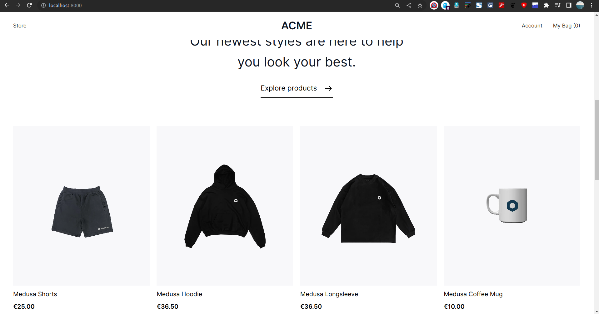
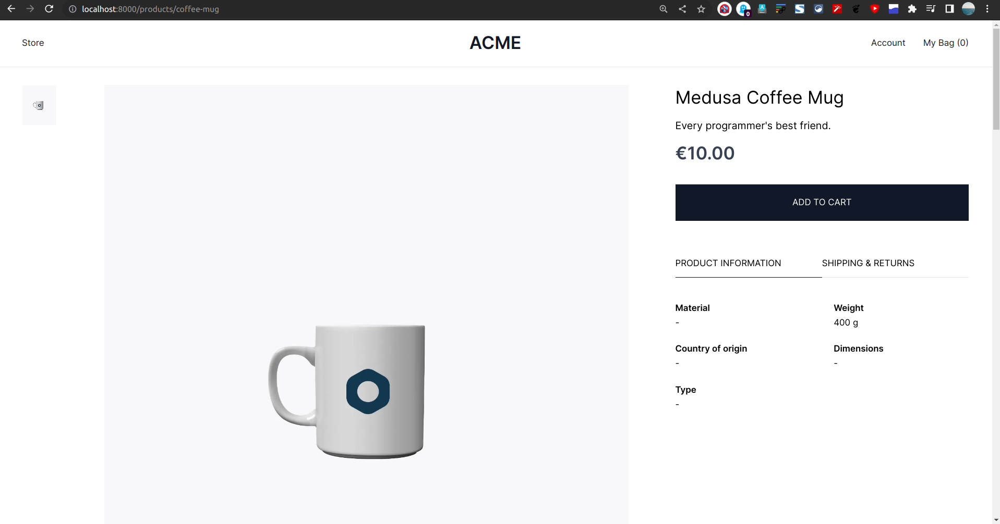
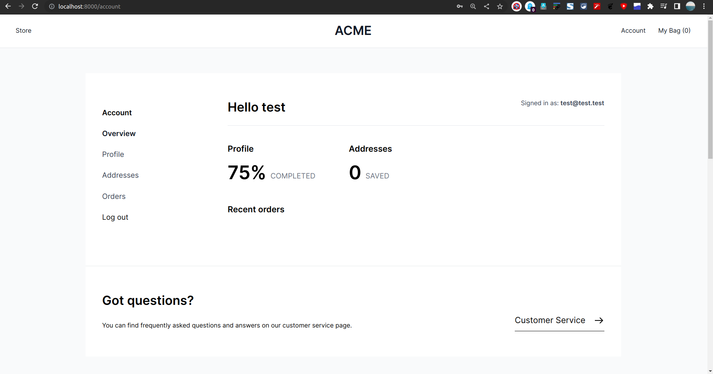

# Shopeee



### Participant Id's

[Github](github.com/ravi0900)

[Twitter](twitter.com/Ravi0541)

[Discord](https://discordapp.com/users/ravi#8906)
Discord : ravi#8906

### Description

I have created a Web storefront using NextJs paired with MedusaJs

### Preview






## Set up Project

Here's how to setup and run the project locally :

### Prerequisites

Here are some pre-requisites that you may require to run the project on your system.

Prerequisites:

- [Medusa CLI](https://www.npmjs.com/package/@medusajs/medusa-cli)
- [Yarn](https://www.npmjs.com/package/yarn)
- [Redis](https://redis.io/)
- [PostgreSQL](https://www.postgresql.org/)
- [Node v16.x](https://node.org/)

### Install Project

Done with the pre-requisites?

Here are the steps to be taken after that :


1. Clone the repository:

```bash
git clone https://github.com/ravi0900/web-store-medusajs.git
```

1. Change directory and install dependencies:

```bash
$ cd web-store-server
$ medusa develop
$ cd ..
$ cd web-store-frontend
$ yarn
$ yarn dev
```
## Resource Credits

Here are some technologies that were very useful throughout the process :

- [Medusa’s GitHub repository](https://github.com/medusajs/medusa)
- [Merdusa Starter Repo](https://github.com/medusajs/nextjs-starter-medusa.git)
- [How to Create Services](https://docs.medusajs.com/advanced/backend/services/create-service)
- [NextJs](https://nextjs.org/)
- [Readme.so](https://readme.so/editor)